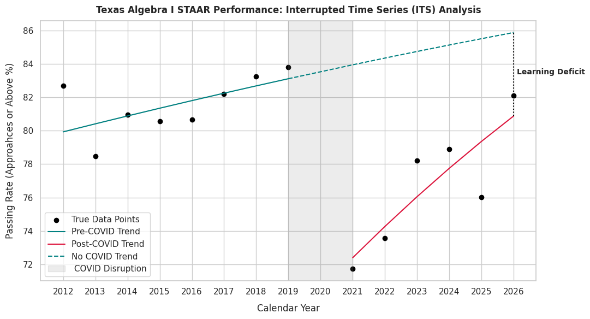

<div align='center'>

  

</div>

# COVID-19's Impact on the Algebra I STAAR Passing Rates

[](https://colab.research.google.com/github/prestonmorg/Covid-STAAR/)
[](LICENSE)

This analysis investigates the COVID-19 pandemic's impact on the passing rates of the Algebra I STAAR (State of Texas Assessments of Academic Readiness) test both in the years prior to and following the pandemic. 

## Installation and Setup
There are two ways to access the analysis provided in this repository. One way is running this locally with Python, and the other way is running this directly through Google Colab. The processes for accessing both methods are outlined below.

### Method 1 - Running Locally
1. **Clone the Repository**
```bash
git clone https://github.com/prestonmorg/Covid-STAAR.git
cd Covid-STAAR
```
2. **Set Up a Virtual Environment (Recommended)**
```bash
# macOS/Linux
python3 -m venv venv
source venv/bin/activate

# Windows
python -m venv venv
venv\Scripts\activate
```
3. **Install Dependencies**
```bash
pip install -r requirements.txt
```
4. **Launch the Notebook**
```bash
jupyter notebook notebooks/Covid_STAAR_Algebra_Notebook.ipynb
```
### Method 2 - Run in Google Colab
If you prefer to run the notebook directly in Google Colab as opposed to setting anything up locally:
1. Click the  badge at the top of this page.
2. Select **Run all** in the top menu.

Note that there is no need to upload the data used in this project to your active Colab runtime session files since the data is read directly from this GitHub repository.

## Data Collection and Cleaning

### Data Source
The source for this data came from the [Texas Assessment Research Portal](https://txresearchportal.com/selections?tab=state) using the **STAAR EOC Group Summary** reports for **Algebra I**.

There are a few things to note:
* Only the **Spring Administration** for each year was chosen to account for when most students would take the EOC (end of curriculum) STAAR test. Excluding results from the Summer, Fall, or Winter exams ensures there are no accidental same-year retakes.
* This same data is accessible for **other subjects** as well. In the 'STAAR_Cumulative_Scores.csv' file, you'll notice that Algebra I is not the only subject listed. This keeps the door open for future projects that will be discussed below! On that same note, I decided to omit tracking the Reading I, Reading II, Writing I, and Writing II scores since they were only tracked from 2012-2013. Thus, it's impossible to run a pre-COVID and post-COVID analysis for those 4 subjects.

### Data Cleaning
There were a few things that needed to be cleaned/processed from the 'STAAR_Cumulative_Scores.csv' file that was obtained using the steps mentioned above.
1. **Filtering the Appropriate Tests:**

Like mentioned above, multiple subjects were included in the collective data file before cleaning. I decided to just look at Algebra I for this project, which meant I only included the Algebra I tests. Furthermore, I excluded the STAAR A (Accommodated) and the STAAR L (Linguistic) tests since the available scores for this test were limited and inconsistent.

2. **Combining Scoring Metrics:**

The state changed the performance metrics and how they categorized student scores. Because of this, I had to bridge the scoring metrics of the two timelines, 2012-2016 and and 2017-2025 (excluding the year 2020 since there were no STAAR tests that year). To bridge the two timelines into one, I ended up making 3 scoring metrics:

  | Unified Metric | 2012–2016 Tiers | 2017–2025 Tiers | What it represents |
  | :--- | :--- | :--- | :--- |
  | **Unsatisfactory** | Unsatisfactory | Did Not Meet | Students who did not pass |
  | **Approaches to Meets** | Satisfactory | Approaches & Meets | Students who passed |
  | **Advanced** | Advanced | Masters | Students who excelled |

3. **Converting Cumulative Counts to Exact Counts:**

One final thing to note is that the STAAR data given from the website has a strange format of only providing counts/percentages for 'X and Above' for every group that isn't the top scoring group from that timeline. However, it was quite easy to work backwards and grab the specific numbers from the strangely formatted data.

## Results and Findings

To see exactly how the COVID-19 pandemic affected the passing rates of the Algebra I STAAR test, I used an **Interruped Time Series (ITS)** model to look at 3 main things:
1. **Pre-Pandemic Trend** (How were scores moving prior to 2020?)
2. **Immediate Affect from Pandemic** (How much were passing rates affected in 2021?)
3. **Post-Pandemic Recovery** (Are there improvements in passing rates? If so, at what rate?)

### 1. Visualizing the Impact

The plot below shows the actual passing rates alongside a counterfactual projection. This projection measures where the student scores would have been had the COVID-19 interruption not happened.



> While passing rates are turning upwards since the occurrence of the COVID-19 pandemic, student performance is still trailing behind where our pre-2020 trends project them to be.

### 2. Regression Model Summary

I fitted a Binomial Generalized Linear Model (GLM) using a logit link function to model the proportion of students passing over time:

$$\text{logit}(P(Y_t)) = \beta_0 + \beta_1 T + \beta_2 D + \beta_3 P$$

| Parameter | Model Variable | Value $\beta$ | What it Measures |
| :---: | :---: | :---: | :--- |
| **Pre-COVID Trend $\beta_1$** | $T$ (Running year count) | `+0.0303` | Growth rate prior to 2020 ($p < 0.001$). |
| **Immediate Shock $\beta_2$** | $D$ ($0 =$ Pre-COVID, <br>$1 =$ Post-COVID) | `-0.7560` | Log-Odds drop of passing rate immediately following COVID ($p < 0.001$). |
| **Post-COVID Trend $\beta_3$** | $P$ (Years since COVID) | `+0.0654` | Growth rate following 2020 ($p < 0.001$). |

> **Key Takeaways:**
> Since log-odds aren't as intuitive to understand, I'll explain the odds ratios (i.e. $e^{\beta}$).
> * **Immediate Pandemic Drop:** Exponentiating $\beta_2$ $(e^{\beta_2} \approx 0.4696)$ tells us that the odds of a student passing in 2021 fell by around 53% compared to the pre-pandemic scores.
> * **Post-COVID Recovery:** Exponentiating $\beta_1 + \beta_3$ $(e^{(\beta_1 + \beta_3)} \approx 1.1004)$ tells us that since the pandemic occurred, the passing odds have been growing by roughly 10.04% each year. Note that $\beta_1$ is our pre-COVID rate, and $\beta_3$ is the rate at which our pre-COVID rate is increasing. That's why we need to include both to explain our overal post-COVID recovery.

### 3. Key Conclusions

* **A Gap Remains Despite Post-COVID Recovery:** Our post-COVID trend, $\beta_3$, shows that there is an improvement in the passing rates of students since the pandemic, but the size of our initial deficit, $\beta_2$, means our scores have yet to reach our pre-COVID predictions. It's important to note that while our recent scores have not yet met up with our pre-COVID projections, they are starting to near our pre-COVID scores.
* **Relevance:** Since Algebra I is such an intrinsic introduction to higher level mathematics for high schoolers, tracking the recovery slope post-COVID is important for locating where academic support is still needed.

## Future Projects

There are a couple of different ways in which we can expand upon this project.

* **Updating the Algebra I Scores:**

Since the STAAR test is an ongoing measure of curriculum proficiency in the state of Texas, scores will continue to be released each year. We could include the new Spring Administration for each year and see how the post-COVID recovery is going once we consider the new scores. I do plan on updating this project each year that new scores are released, but STAAR is also being updated for the 2026-2027 academic year so I need to dive deeper into that beforehand.
* **Running Analyses on Different Subjects:**

Another idea we could expand upon in relation to this project is doing this analysis for each subject tested by STAAR, and even doing an entire collective project over how STAAR scores have been affected by all tested subjects.


## Acknowledgements and References

I'd like to thank Giancarlo Villatoro for their support and guidance over planning and editing this project.

Header Photo by [Susan Q Yin](https://unsplash.com/@syinq?utm_source=unsplash&utm_medium=referral&utm_content=creditCopyText) on [Unsplash](https://unsplash.com/photos/books-on-brown-wooden-shelf-2JIvboGLeho?utm_source=unsplash&utm_medium=referral&utm_content=creditCopyText")
      

## License
This project is open-source and available under the [MIT License](LICENSE).
